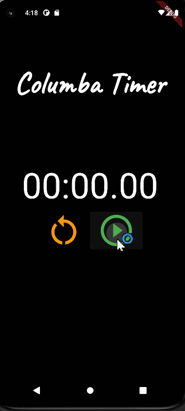

# columba
This application is made to see how the providers and the states work in flutter 3.

## Structure for Cronometer App
This app contain in the main, timeProvider for notify the app when the time changes
and control the status for the timer. 

## Cronometer Widget

  

